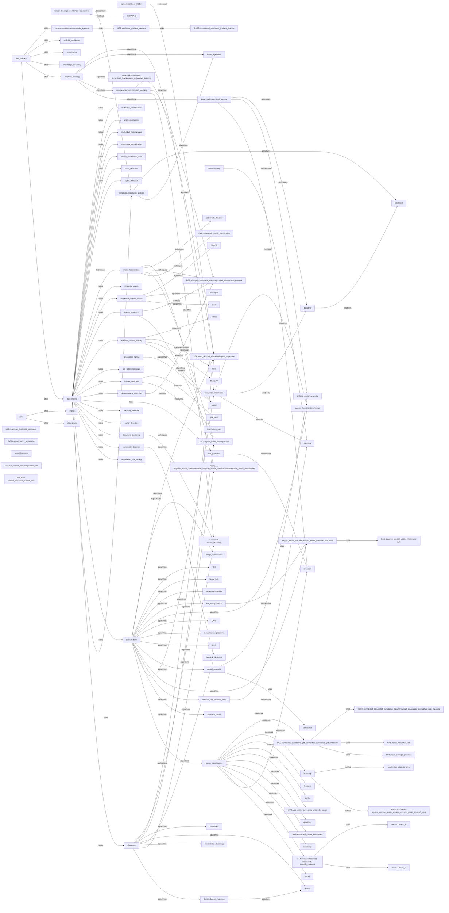

```mermaid
graph LR
N0[data_science]
N256[DCG,discounted_cumulative_gain,discounted_cumulative_gain_measure]
N13[neural_networks]
N243[N/A]
N261[F1,f-measure,f-score,f1-measure,f1-score,f1_measure]
N38[tensor_decomposition,tensor_factorization]
N41[decision_tree,decision_trees]
N82[topic_model,topic_models]
N180[link_prediction]
N202[text_categorization]
N229[bootstrapping]
N4[classification]
N6[binary_classification]
N9[clustering]
N10[density-based_clustering]
N11[frequent_itemset_mining]
N12[apriori]
N21[matrix_factorization]
N28[sensitivity]
N29[specificity]
N44[ensemble,ensembles]
N50[k-means,k-means_clustering]
N62[random_forest,random_forests]
N72[semi-supervised,semi-supervised_learning,semi_supervised_learning]
N74[supervised,supervised_learning]
N85[unsupervised,unsupervised_learning]
N87[recall]
N96[SVD,singular_value_decomposition]
N110[NMI,normalized_mutual_information]
N116[MAE,mean_absolute_error]
N122[NB,naive_bayes]
N132[MLE,maximum_likelihood_estimation]
N139[SVR,support_vector_regression]
N146[PMF,probabilistic_matrix_factorization]
N148[AUC,area_under_curve,area_under_the_curve]
N151[boosting]
N156[accuracy]
N159[PCA,principal_component_analysis,principal_components_analysis]
N169[C4.5]
N170[association_rule_mining]
N171[hierarchical_clustering]
N172[community_detection]
N173[document_clustering]
N174[outlier_detection]
N176[anomaly_detection]
N177[GSP]
N178[prefixspan]
N183[k_nearest_neighbor,knn]
N184[spectral_clustering]
N185[dimensionality_reduction]
N187[CART]
N192[dbscan]
N193[feature_selection]
N194[sequential_pattern_mining]
N195[link_recommendation]
N197[feature_extraction]
N198[fp-growth]
N200[k-medoids]
N203[information_gain]
N204[similarity_search]
N205[linear_regression]
N206[adaboost]
N209[eclat]
N210[bayesian_networks]
N211[SPADE]
N212[gini_index]
N214[linear_svm]
N224[PARAFAC]
N225[spam_detection]
N226[fraud_detection]
N227[association_mining]
N228[mining_association_rules]
N230[multi-class_classification]
N231[multi-label_classification]
N233[image_classification]
N237[coordinate_descent]
N238[closet]
N239[kernel_k-means]
N244[purity]
N246[ID3]
N247[entity_recognition]
N248[multiclass_classification]
N249[f1_score]
N251[RMSE,root-mean-square_error,root_mean_square_error,root_mean_squared_error]
N254[NMF,non-negative_matrix_factorization,non_negative_matrix_factorization,nonnegative_matrix_factorization]
N258[TPR,true_positive_rate,truepositive_rate]
N259[FPR,false-positive_rate,false_positive_rate]
N35[recommendation,recommender_systems]
N107[support_vector_machine,support_vector_machines,svm,svms]
N1[data_mining]
N2[machine_learning]
N14[perceptron]
N23[artificial_neural_networks]
N53[macro-f1,macro_f1]
N55[micro-f1,micro_f1]
N64[regression,regression_analysis]
N86[precision]
N99[MAP,mean_average_precision]
N113[MRR,mean_reciprocal_rank]
N150[bagging]
N168[knowledge_discovery]
N189[visualization]
N196[artificial_intelligence]
N241[closegraph]
N242[gspan]
N253[LDA,latent_dirichlet_allocation,logistic_regression]
N255[NDCG,normalized_discounted_cumulative_gain,normalized_discounted_cumulative_gain_measure]
N106[SGD,stochastic_gradient_descent]
N223[least_squares_support_vector_machine,ls-svm]
N191[CSGD,constrained_stochastic_gradient_descent]
N0 --> |child| N1
N0 --> |child| N2
N0 --> |child| N168
N0 --> |child| N189
N0 --> |child| N196
N0 --> |child| N35
N256 --> |child| N99
N256 --> |child| N113
N256 --> |child| N255
N13 --> |child| N14
N13 --> |child| N23
N243 --> |child| N241
N243 --> |child| N242
N261 --> |child| N55
N261 --> |child| N53
N38 --> |methods| N224
N38 --> |descendant| N64
N41 --> |descendant| N150
N82 --> |descendant| N253
N180 --> |descendant| N86
N202 --> |descendant| N107
N229 --> |descendant| N150
N4 --> |applications| N6
N4 --> |algorithms| N44
N4 --> |algorithms| N122
N4 --> |algorithms| N41
N4 --> |algorithms| N107
N4 --> |algorithms| N13
N4 --> |algorithms| N169
N4 --> |algorithms| N183
N4 --> |algorithms| N187
N4 --> |algorithms| N62
N4 --> |applications| N202
N4 --> |algorithms| N210
N4 --> |algorithms| N214
N4 --> |algorithms| N246
N4 --> |algorithms| N253
N4 --> |applications| N233
N6 --> |measures| N86
N6 --> |measures| N87
N6 --> |measures| N261
N6 --> |measures| N28
N6 --> |measures| N110
N6 --> |measures| N29
N6 --> |measures| N148
N6 --> |measures| N244
N6 --> |measures| N249
N6 --> |measures| N156
N6 --> |measures| N256
N9 --> |algorithms| N10
N9 --> |algorithms| N50
N9 --> |algorithms| N171
N9 --> |algorithms| N184
N9 --> |algorithms| N192
N9 --> |algorithms| N200
N9 --> |algorithms| N96
N9 --> |algorithms| N253
N9 --> |algorithms| N254
N10 --> |algorithms| N192
N11 --> |algorithms| N12
N11 --> |algorithms| N198
N11 --> |algorithms| N209
N11 --> |algorithms| N238
N21 --> |techniques| N146
N21 --> |techniques| N96
N21 --> |techniques| N159
N21 --> |techniques| N237
N21 --> |techniques| N254
N44 --> |methods| N150
N44 --> |methods| N151
N44 --> |methods| N62
N74 --> |measures| N86
N74 --> |techniques| N23
N74 --> |techniques| N151
N85 --> |algorithms| N50
N85 --> |algorithms| N159
N85 --> |algorithms| N253
N151 --> |methods| N206
N156 --> |metrics| N251
N156 --> |metrics| N116
N172 --> |algorithms| N184
N173 --> |techniques| N50
N185 --> |methods| N159
N193 --> |measures| N203
N193 --> |measures| N212
N194 --> |algorithms| N177
N194 --> |algorithms| N178
N194 --> |algorithms| N211
N197 --> |methods| N96
N197 --> |methods| N159
N227 --> |approaches| N12
N35 --> |child| N106
N107 --> |child| N223
N1 --> |tasks| N9
N1 --> |tasks| N64
N1 --> |tasks| N4
N1 --> |tasks| N170
N1 --> |tasks| N172
N1 --> |tasks| N173
N1 --> |tasks| N174
N1 --> |tasks| N176
N1 --> |tasks| N180
N1 --> |tasks| N185
N1 --> |tasks| N193
N1 --> |tasks| N195
N1 --> |tasks| N11
N1 --> |tasks| N197
N1 --> |tasks| N194
N1 --> |tasks| N204
N1 --> |techniques| N21
N1 --> |tasks| N225
N1 --> |tasks| N226
N1 --> |tasks| N228
N1 --> |tasks| N230
N1 --> |tasks| N231
N1 --> |tasks| N247
N1 --> |tasks| N248
N2 --> |algorithms| N74
N2 --> |algorithms| N85
N2 --> |algorithms| N72
N2 --> |algorithms| N205
N2 --> |algorithms| N44
N64 --> |algorithms| N205
N64 --> |algorithms| N206
N106 --> |child| N191
```
