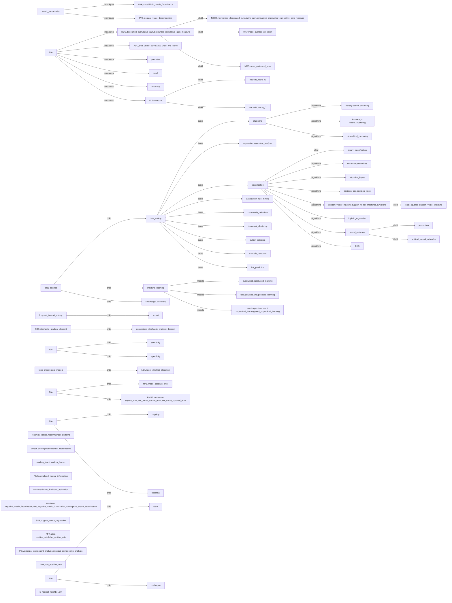

```mermaid
graph LR
N0[data_science]
N140[DCG,discounted_cumulative_gain,discounted_cumulative_gain_measure]
N13[neural_networks]
N30[N/A]
N149[N/A]
N152[N/A]
N175[F1,f-measure]
N179[N/A]
N4[classification]
N11[frequent_itemset_mining]
N82[topic_model,topic_models]
N106[SGD,stochastic_gradient_descent]
N107[support_vector_machine,support_vector_machines,svm,svms]
N9[clustering]
N10[density-based_clustering]
N21[matrix_factorization]
N35[recommendation,recommender_systems]
N38[tensor_decomposition,tensor_factorization]
N41[decision_tree,decision_trees]
N44[ensemble,ensembles]
N50[k-means,k-means_clustering]
N62[random_forest,random_forests]
N64[regression,regression_analysis]
N72[semi-supervised,semi-supervised_learning,semi_supervised_learning]
N74[supervised,supervised_learning]
N85[unsupervised,unsupervised_learning]
N86[precision]
N87[recall]
N96[SVD,singular_value_decomposition]
N110[NMI,normalized_mutual_information]
N122[NB,naive_bayes]
N132[MLE,maximum_likelihood_estimation]
N136[NMF,non-negative_matrix_factorization,non_negative_matrix_factorization,nonnegative_matrix_factorization]
N139[SVR,support_vector_regression]
N143[FPR,false-positive_rate,false_positive_rate]
N146[PMF,probabilistic_matrix_factorization]
N148[AUC,area_under_curve,area_under_the_curve]
N154[logistic_regression]
N156[accuracy]
N159[PCA,principal_component_analysis,principal_components_analysis]
N162[TPR,true_positive_rate]
N167[N/A]
N169[C4.5]
N170[association_rule_mining]
N171[hierarchical_clustering]
N172[community_detection]
N173[document_clustering]
N174[outlier_detection]
N176[anomaly_detection]
N180[link_prediction]
N183[k_nearest_neighbor,knn]
N1[data_mining]
N2[machine_learning]
N6[binary_classification]
N12[apriori]
N14[perceptron]
N20[least_squares_support_vector_machine]
N23[artificial_neural_networks]
N25[constrained_stochastic_gradient_descent]
N28[sensitivity]
N29[specificity]
N53[macro-f1,macro_f1]
N55[micro-f1,micro_f1]
N91[LDA,latent_dirichlet_allocation]
N99[MAP,mean_average_precision]
N113[MRR,mean_reciprocal_rank]
N116[MAE,mean_absolute_error]
N119[NDCG,normalized_discounted_cumulative_gain,normalized_discounted_cumulative_gain_measure]
N134[RMSE,root-mean-square_error,root_mean_square_error,root_mean_squared_error]
N150[bagging]
N151[boosting]
N168[knowledge_discovery]
N177[GSP]
N178[prefixspan]
N0 --> |child| N1
N0 --> |child| N2
N0 --> |child| N168
N140 --> |child| N119
N140 --> |child| N99
N140 --> |child| N113
N13 --> |child| N14
N13 --> |child| N23
N30 --> |child| N28
N30 --> |child| N29
N149 --> |child| N116
N149 --> |child| N134
N152 --> |child| N150
N152 --> |child| N151
N175 --> |child| N55
N175 --> |child| N53
N179 --> |child| N177
N179 --> |child| N178
N4 --> |child| N6
N4 --> |algorithms| N44
N4 --> |algorithms| N122
N4 --> |algorithms| N41
N4 --> |algorithms| N107
N4 --> |algorithms| N154
N4 --> |algorithms| N13
N4 --> |algorithms| N169
N11 --> |child| N12
N82 --> |child| N91
N106 --> |child| N25
N107 --> |child| N20
N9 --> |algorithms| N10
N9 --> |algorithms| N50
N9 --> |algorithms| N171
N21 --> |techniques| N146
N21 --> |techniques| N96
N167 --> |measures| N140
N167 --> |measures| N148
N167 --> |measures| N86
N167 --> |measures| N87
N167 --> |measures| N156
N167 --> |measures| N175
N1 --> |tasks| N9
N1 --> |tasks| N64
N1 --> |tasks| N4
N1 --> |tasks| N170
N1 --> |tasks| N172
N1 --> |tasks| N173
N1 --> |tasks| N174
N1 --> |tasks| N176
N1 --> |tasks| N180
N2 --> |models| N74
N2 --> |models| N85
N2 --> |models| N72
```
